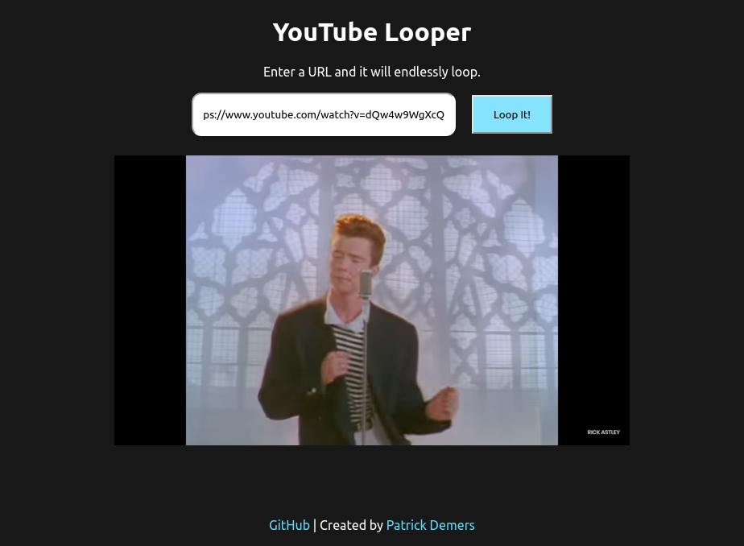

# YouTube Looper

Loop a given YouTube video endlessly. 
This web app is slightly different than other available
loopers as the video is never allowed to finish.
This is useful when casting to another device as the stream to the TV does not disconnect at the end of each loop.

# Screenshot
